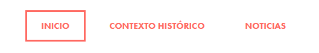

# 1st Term Delivery
# Style Guide - Christmas at Calasanz

- Introduction
    - Importance of Christmas for Calasanz
- Menu:
    - Home
    - Historical Context
    - News
- Considerations:
    - Responsive (two levels)
        - Normal screen
        - Mobile
    - One page with a form
- Logo
- Colors
- Layout
- Typography

## Introduction
This style guide defines the visual and structural elements for the Christmas-themed website of Calasanz School. The design centers on a nativity scene, reflecting the center's Christian values and the importance of Christmas in people's lives.

### Importance of Christmas for Calasanz
1. Celebration of Jesus' birth: As a Christian center, Calasanz considers Christmas one of the most important festivities of the year, commemorating the birth of Jesus Christ and the values He represents.

2. Transmission of Christian values: Christmas offers a unique opportunity to reinforce and teach Christian values such as love, generosity, compassion, and peace.

3. Strengthening the school community: Christmas celebrations unite students, teachers, and families, strengthening the sense of community and belonging to the school.

4. Educational opportunity: The school uses this time to teach about biblical history, cultural traditions, and the importance of spiritual reflection.

5. Promotion of solidarity: Charitable activities and aid campaigns are organized, teaching students the importance of helping those in need.

6. Artistic and cultural expression: Through nativity scene representations, carol concerts, and other activities, artistic expression and knowledge of cultural traditions are encouraged.

7. Reflection and personal growth: Students are encouraged to reflect on the past year and set personal and spiritual goals for the future.

8. Connection with families: Christmas is a time to involve families more in school life, strengthening the relationship between home and school.

## Menu
- Home (Nativity scene and description)
- Historical Context
- News (Performances, carols, etc.)

### Example

## Considerations
- Responsive design with two levels:
  - Normal screen (desktop)
  - Mobile
- One page with a form (for uploading news/posts)
- Support for multiple languages

## Footer
- Contact informacion (address, phone number, email)
- Social media

## Colors
- White: #ffffff (Main background, text on dark backgrounds)
- Gray: #414141 (Main text, secondary elements)
- Red: #ff6860 (Accents, Christmas elements)
- Green: #ccdfcc (Christmas elements, soft backgrounds)
- Blue: #0e6670 (Headers, highlighted elements)

Usage:
- White, gray, and blue for a modern touch
- Red and green to represent Christmas
- Combine to achieve visual balance

## Layout
- Header: Logo on the left, menu on the right
- Body: Single column design for mobile, two columns for desktop
- Footer: Contact information, quick links, language selector

## Typography
- Main font: Roboto or Futura
- Sizes:
  - Titles: 24px - 36px
  - Subtitles: 18px - 24px
  - Main text: 16px
  - Secondary text: 14px

## Icons
- Style: Simple lines, solid fill
- Size: 24px x 24px for navigation, 16px x 16px for inline elements
- Color: Adapt to the color palette according to context

## Specific Elements
1. Nativity Scene:
   - Featured image on the home page
   - Detailed description with clear typography
2. Form:
   - Fields with soft borders
   - Buttons in blue (#0e6670) with white text
3. Language Selector:
   - Located in the footer
   - Flag icons or language codes (ES, EN, etc.)

## Responsive Design
- Main breakpoint: 768px
- Menu: Hamburger on mobile, expanded on desktop
- Images: Adjust size and resolution according to device
- Typography: Reduce sizes by 10-15% for mobile
