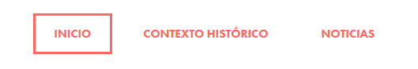
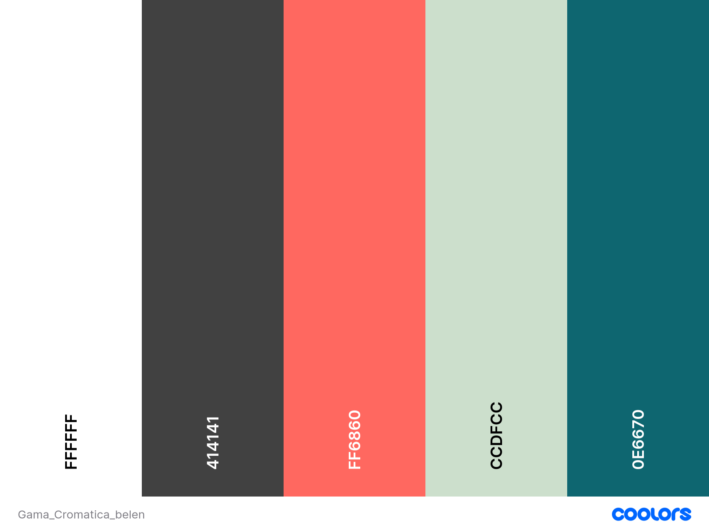

# Entrega 1º Trimestre
# Guía de Estilos - Navidad en Calasanz

- Introducción
    - Importancia de la navidad para el Calasanz
- Menú:
    - Inicio
    - Contexto histórico
    - Noticias
- Consideraciones:
    - Responsive (dos niveles)
        - Pantalla normal
        - Móvil
    - Una página con formulario
- Logo
- Colores
- Distribución (Layout)
- Tipografía

## Introducción
Esta guía de estilos define los elementos visuales y estructurales para la web temática de Navidad del colegio Calasanz. El diseño se centra en un belén, reflejando los valores cristianos del centro y la importancia de la Navidad en la vida de las personas.

### Importancia de la navidad para el Calasanz
1. Celebración del nacimiento de Jesús: Como centro cristiano, el Calasanz considera la Navidad como una de las festividades más importantes del año, conmemorando el nacimiento de Jesucristo y los valores que representa.

2. Transmisión de valores cristianos: La Navidad ofrece una oportunidad única para reforzar y enseñar valores cristianos como el amor, la generosidad, la compasión y la paz.

3. Fortalecimiento de la comunidad escolar: Las celebraciones navideñas unen a estudiantes, profesores y familias, fortaleciendo el sentido de comunidad y pertenencia al colegio.

4. Oportunidad educativa: El colegio aprovecha esta época para enseñar sobre la historia bíblica, las tradiciones culturales y la importancia de la reflexión espiritual.

5. Fomento de la solidaridad: Se organizan actividades benéficas y campañas de ayuda, enseñando a los alumnos la importancia de ayudar a los más necesitados.

6. Expresión artística y cultural: A través de representaciones del belén, conciertos de villancicos y otras actividades, se fomenta la expresión artística y el conocimiento de las tradiciones culturales.

7. Reflexión y crecimiento personal: Se anima a los estudiantes a reflexionar sobre el año transcurrido y a establecer metas personales y espirituales para el futuro.

8. Conexión con las familias: La Navidad es un momento para involucrar más a las familias en la vida escolar, fortaleciendo la relación entre el hogar y el colegio.
## Menú
- Inicio (Belén y descripción)
- Contexto histórico
- Noticias (Representaciones, villancicos, etc.)
### Ejemplo

## Consideraciones
- Diseño responsive con dos niveles:
  - Pantalla normal (desktop)
  - Móvil
- Una página con formulario (para subir noticias/posts)
- Soporte para múltiples idiomas

## Footer
- Información de contacto
- Redes sociales

## Gama cromática

- Uso:
  - Blanco, gris y azul para un toque moderno
  - Rojo y verde para representar la Navidad
  - Combinar para lograr un equilibrio visual

## Distribución (Layout)
- Encabezado: Logo a la izquierda, menú a la derecha
- Cuerpo: Diseño de una columna para móviles, dos columnas para desktop
- Pie de página: Información de contacto, enlaces rápidos, selector de idioma

## Tipografía
- Fuente principal: Roboto o Futura
- Tamaños:
  - Títulos: 24px - 36px
  - Subtítulos: 18px - 24px
  - Texto principal: 16px
  - Texto secundario: 14px

## Iconos
- Estilo: Líneas simples, relleno sólido
- Tamaño: 24px x 24px para navegación, 16px x 16px para elementos inline
- Color: Adaptar a la paleta de colores según el contexto

## Elementos específicos
1. Belén:
   - Imagen destacada en la página de inicio
   - Descripción detallada con tipografía clara
2. Formulario:
   - Campos con bordes suaves
   - Botones en color azul (#0e6670) con texto blanco
3. Selector de idiomas:
   - Ubicado en el pie de página
   - Iconos de banderas o códigos de idioma (ES, EN, etc.)

## Responsive Design
- Breakpoint principal: 768px
- Menú: Hamburguesa en móvil ☰, expandido en desktop
- Imágenes: Ajustar tamaño y resolución según dispositivo
- Tipografía: Reducir tamaños en un 10-15% para móviles

